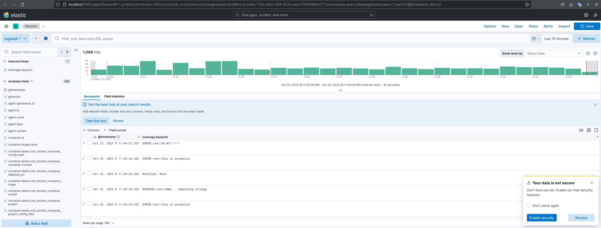

# 10-monitoring-03-grafana

## Результаты выполнения задания

### 1. Список запущенных контейнеров ('docker ps'):

```
[ditry@master_home 10-monitoring-04-elk]$ docker ps
CONTAINER ID   IMAGE                    COMMAND                  CREATED          STATUS          PORTS                                                                                            NAMES
5d42a59221f7   elastic/filebeat:8.7.0   "/usr/bin/tini -- /u…"   23 minutes ago   Up 19 minutes                                                                                                    filebeat
034a0affa7ef   kibana:8.7.0             "/bin/tini -- /usr/l…"   23 minutes ago   Up 19 minutes   0.0.0.0:5601->5601/tcp, :::5601->5601/tcp                                                        kibana
a844dceb3cd1   logstash:8.7.0           "/usr/local/bin/dock…"   23 minutes ago   Up 19 minutes   0.0.0.0:5044->5044/tcp, :::5044->5044/tcp, 0.0.0.0:5046->5046/tcp, :::5046->5046/tcp, 9600/tcp   logstash
4fc16588d974   elasticsearch:8.7.0      "/bin/tini -- /usr/l…"   23 minutes ago   Up 19 minutes   0.0.0.0:9200->9200/tcp, :::9200->9200/tcp, 9300/tcp                                              es-hot
f86a7fcbb266   python:3.9-alpine        "python3 /opt/run.py"    23 minutes ago   Up 19 minutes                                                                                                    some_app
2238dfa7c9d1   elasticsearch:8.7.0      "/bin/tini -- /usr/l…"   23 minutes ago   Up 19 minutes   9200/tcp, 9300/tcp                                                                               es-warm
```

### 2. Screen-shot Kibana

